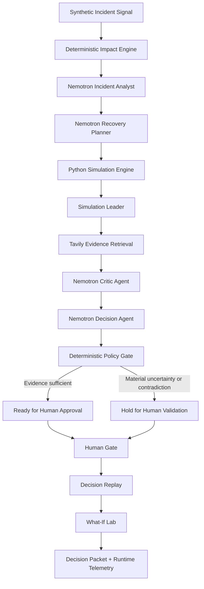

# NEXUS — AI Supply Chain Crisis Commander

> **An autonomous AI incident commander that detects supply-chain disruptions, identifies affected shipments, simulates recovery options, challenges its own recommendations, and delivers an evidence-backed action plan.**

[](https://nexusai-supplychain.streamlit.app/)
[](https://www.python.org/)
[](https://streamlit.io/)
[](https://fastapi.tiangolo.com/)
[](https://nebius.com/)
[](https://tavily.com/)

**Live application:** https://nexusai-supplychain.streamlit.app/

---

## Why NEXUS

When a major logistics disruption occurs, the hardest problem is not simply detecting it. Operations teams must quickly answer:

- Which shipments are actually exposed?
- Which shipments matter most?
- What recovery options are available?
- What are the cost, delay, risk, and SLA trade-offs?
- Which assumptions are unsupported?
- What public evidence contradicts the current plan?
- Is there enough confidence to act, or should a human stop the workflow?

NEXUS is designed around that complete decision loop.

Instead of asking one LLM to generate a recommendation and trusting the answer, NEXUS separates **AI reasoning**, **deterministic simulation**, **external evidence retrieval**, **critical review**, and **human approval**.

---

## Demo Scenario

The current hackathon demonstration uses a **synthetic global shipment network** and a seeded severe-weather incident affecting Memphis.

| Metric | Demo value |
|---|---:|
| Active shipments | 1,200 |
| Active incidents | 1 |
| Exposed shipments | 234 |
| Critical exposed shipments | 18 |
| Incident severity | 88% |
| Incident confidence | 92% |
| Incident radius | 250 km |
| Expected duration | 14 hours |

All shipment data, incident data, costs, route calculations, and simulation results in the demo are synthetic.

---

## What NEXUS Does

NEXUS runs an eight-stage crisis-response workflow:

```text
DETECT
   ↓
IMPACT
   ↓
ANALYZE
   ↓
PLAN
   ↓
SIMULATE
   ↓
CHALLENGE
   ↓
DECIDE
   ↓
HUMAN GATE
   ↓
REPLAY + WHAT-IF
   ↓
DEMO / AUDIT READINESS
```

### 1. Detect

Loads a disruption signal with severity, confidence, geographic radius, expected duration, affected modes, and source metadata.

### 2. Impact

A deterministic Python engine calculates which shipments are exposed using:

- geospatial distance,
- affected transport modes,
- shipment status,
- shipment priority,
- incident radius,
- incident severity.

The LLM does **not** determine shipment exposure.

### 3. Analyze

NVIDIA Nemotron, accessed through **Nebius Token Factory**, converts the structured incident and impact data into an operational brief containing:

- executive summary,
- operational assessment,
- priority triage actions,
- watch items,
- assumptions,
- model confidence.

Current model:

```text
nvidia/nemotron-3-super-120b-a12b
```

### 4. Plan

Nemotron generates three **bounded recovery strategy types**:

- Hold and monitor
- Reroute all exposed shipments
- Protect critical + high-priority shipments

The planner is not allowed to invent simulation metrics.

### 5. Simulate

A deterministic Python simulator calculates each strategy's:

- average recovery delay,
- incremental cost,
- residual disruption risk,
- SLA exposure,
- critical shipments protected,
- number of shipments rerouted,
- composite comparison score.

The default comparison weights are:

| Dimension | Weight |
|---|---:|
| Delay | 35% |
| Cost | 20% |
| Residual risk | 30% |
| SLA exposure | 15% |

Lower composite score is better.

The lowest score is labeled **Simulation Leader**, not Final Recommendation.

### 6. Challenge

The simulation leader is actively challenged instead of automatically accepted.

**Tavily** retrieves a focused live public-evidence snapshot for assumptions such as:

- alternate-hub operational status,
- weather conditions,
- surface-access disruptions,
- airport delays or closures.

A separate Nemotron Critic evaluates assumptions using only supplied evidence and returns:

```text
SUPPORTED
UNVERIFIED
CONTRADICTED
```

Absence of evidence is treated as **UNVERIFIED**, not as contradiction.

### 7. Decide + Human Gate

The final decision agent combines:

- Stage 4 deterministic simulation,
- Stage 5 Critic findings,
- Stage 5 Tavily evidence,
- unresolved assumptions.

A deterministic policy gate then evaluates the result.

Possible outcomes:

```text
READY FOR HUMAN APPROVAL
```

or

```text
HOLD FOR HUMAN VALIDATION
```

The policy gate can override the LLM.

For example, if a material assumption is contradicted by supplied evidence, NEXUS will hold the plan even if the simulation ranked it first.

### 8. Replay + What-If + Readiness

NEXUS exposes the full decision path through:

**Decision Replay**
- Shows what happened at each stage
- Identifies the system of record
- Displays model/runtime metadata
- Does not expose hidden chain-of-thought

**What-If Lab**
- Reweights delay, cost, risk, and SLA priorities
- Re-ranks the same deterministic Stage 4 scenarios
- Makes **0 new Nemotron calls**
- Makes **0 new Tavily searches**
- Cannot override Stage 5/6 evidence controls

**Demo / Deployment Readiness**
- Runtime telemetry
- Evidence freshness
- Policy-gate status
- Model/search usage
- Exportable evidence-backed JSON decision packet

---

## Architecture



### Separation of responsibilities

| Component | Responsibility |
|---|---|
| Python impact engine | Exposure, geospatial matching, deterministic risk |
| Nemotron Analyst | Operational interpretation |
| Nemotron Planner | Bounded recovery strategy generation |
| Python simulator | Delay, cost, risk, SLA and strategy scoring |
| Tavily | Current public evidence retrieval |
| Nemotron Critic | Challenge assumptions using supplied evidence |
| Decision Agent | Evidence-backed synthesis |
| Policy Gate | Deterministic go/hold control |
| Human operator | Final authority |
| Replay / What-If | Explainability and scenario exploration |

---

## Why This Architecture Matters

A conventional AI workflow might be:

```text
Incident → LLM → Recommendation
```

NEXUS instead uses:

```text
Incident
   ↓
Deterministic exposure
   ↓
AI analysis
   ↓
AI-generated bounded strategies
   ↓
Deterministic simulation
   ↓
External evidence
   ↓
Independent AI critic
   ↓
Decision synthesis
   ↓
Deterministic policy gate
   ↓
Human approval
```

The system is deliberately designed so that the LLM is **not the source of truth for numeric logistics outcomes** and cannot bypass the policy gate.

---

## Example Decision Behavior

A typical demonstration may produce a simulation leader such as:

```text
Full Reroute via ATL
```

The deterministic simulator can show why that scenario leads on the configured business objective.

But the Tavily + Critic stage can discover evidence that challenges assumptions about ATL congestion, operational limits, or transfer timeliness.

NEXUS can therefore finish with:

```text
HOLD FOR HUMAN VALIDATION
```

rather than forcing a recommendation.

That behavior is intentional.

---

## What-If Analysis

The What-If Lab includes presets such as:

- Balanced
- Speed First
- Cost First
- Risk First
- SLA Protection
- Custom

A cost-focused weighting can produce a different scenario leader than the balanced configuration.

When the leader changes, NEXUS explicitly marks it as requiring a **fresh evidence challenge** before it could enter the real decision path.

---

## Evidence and Safety Guardrails

NEXUS follows several hard rules:

1. **Synthetic scenario disclosure**  
   The demonstration incident and shipment network are synthetic.

2. **Deterministic numeric outcomes**  
   Cost, delay, residual risk, SLA exposure, shipment targeting, and scores are calculated in Python.

3. **No unsupported evidence claims**  
   Tavily results challenge assumptions about real-world alternate hubs but are never presented as proof that the synthetic incident itself is real.

4. **Unverified is not contradicted**  
   Missing evidence remains explicitly unresolved.

5. **Policy gate beats the model**  
   A deterministic guardrail can force a human hold.

6. **Human remains final authority**  
   The application does not change shipments, book transportation, contact carriers, or update a production TMS.

7. **Evidence freshness**  
   Stage 6 can reject stale Stage 5 evidence and request a refreshed challenge.

---

## Technology Stack

### AI / Reasoning

- **NVIDIA Nemotron 3 Super 120B A12B**
- **Nebius Token Factory**
- OpenAI-compatible inference client

### Evidence

- **Tavily Search API**
- Evidence deduplication
- Source-ID validation
- Evidence freshness checks

### Backend / Decision Engines

- Python
- FastAPI
- Pydantic
- Deterministic geospatial impact engine
- Deterministic recovery simulator
- Deterministic policy gate

### Frontend / Visualization

- Streamlit
- Plotly
- Pandas
- Custom CSS command-center UI

### Deployment

- Streamlit Community Cloud
- Embedded NEXUS runtime for hosted Stage 1/2 calculations
- Optional FastAPI runtime for local/API testing

---

## Project Structure

```text
Nexus-AI-Supply-Chain/
├── app/
│   ├── data.py
│   ├── impact.py
│   ├── main.py
│   └── models.py
│
├── services/
│   ├── critic_service.py
│   ├── decision_packet_service.py
│   ├── decision_service.py
│   ├── nemotron_service.py
│   ├── nexus_api.py
│   ├── recovery_planner.py
│   ├── replay_service.py
│   ├── simulation_service.py
│   ├── tavily_service.py
│   ├── telemetry_service.py
│   └── what_if_service.py
│
├── ui/
│   ├── dashboard.py
│   └── styles/
│       └── nexus.css
│
├── scripts/
│   ├── test_nebius.py
│   ├── test_stage4_simulation.py
│   ├── test_stage6_decision_gate.py
│   ├── test_stage7_explainability.py
│   └── test_tavily.py
│
├── streamlit_app.py
├── requirements.txt
├── STREAMLIT_DEPLOY.md
└── README.md
```

---

## Run Locally

### 1. Clone

```bash
git clone https://github.com/abhik12295/Nexus-AI-Supply-Chain.git
cd Nexus-AI-Supply-Chain
```

### 2. Create an environment

```bash
python -m venv .venv
source .venv/bin/activate
```

Windows:

```powershell
.venv\Scripts\Activate.ps1
```

### 3. Install dependencies

```bash
pip install -r requirements.txt
```

### 4. Configure environment variables

Create a local `.env` file:

```env
NEBIUS_API_KEY=your_nebius_token_factory_key
NEBIUS_BASE_URL=https://api.tokenfactory.us-central1.nebius.com/v1/
NEBIUS_MODEL=nvidia/nemotron-3-super-120b-a12b

TAVILY_API_KEY=your_tavily_key
TAVILY_BASE_URL=https://api.tavily.com

NEXUS_API_URL=embedded
```

Never commit API keys.

### 5. Run Streamlit

```bash
streamlit run streamlit_app.py
```

---

## Optional FastAPI Mode

The hosted Streamlit application uses the embedded NEXUS runtime.

For local API testing, start FastAPI:

```bash
uvicorn app.main:app --reload
```

Then set:

```env
NEXUS_API_URL=http://127.0.0.1:8000
```

FastAPI documentation is available locally at:

```text
http://127.0.0.1:8000/docs
```

---

## Validation Scripts

Test Nebius:

```bash
python scripts/test_nebius.py
```

Test Tavily:

```bash
python scripts/test_tavily.py
```

Test deterministic recovery simulation:

```bash
python scripts/test_stage4_simulation.py
```

Test decision guardrail:

```bash
python scripts/test_stage6_decision_gate.py
```

Test replay and What-If:

```bash
python scripts/test_stage7_explainability.py
```

---

# Project Story

## Inspiration

Global logistics disruptions are rarely single-variable problems. A storm, airport closure, geopolitical event, infrastructure failure, or congestion event can affect hundreds of shipments at once.

The real operational challenge is not simply identifying that a disruption exists. Teams must determine which shipments are exposed, understand their business importance, evaluate recovery options, estimate the trade-offs, validate assumptions against current evidence, and decide whether the information is strong enough to act.

NEXUS was inspired by the idea that an AI operations system should not simply generate a confident answer. It should be capable of **challenging its own recommendation and knowing when the correct action is to stop and request human validation**.

## What it does

NEXUS acts as an AI Supply Chain Crisis Commander.

It:

- detects a disruption,
- identifies exposed shipments deterministically,
- prioritizes critical exposure,
- generates an operational incident brief,
- creates bounded recovery strategies,
- simulates delay/cost/risk/SLA trade-offs,
- ranks the strategies,
- retrieves current public evidence,
- challenges the leading strategy,
- distinguishes supported, unverified, and contradicted assumptions,
- produces an evidence-backed decision,
- applies a deterministic policy gate,
- preserves human approval,
- explains the entire decision through replay,
- and allows operators to run no-cost What-If analysis.

## How we built it

NEXUS combines AI reasoning with deterministic logistics engines.

Nemotron is used where reasoning and synthesis are valuable: incident analysis, strategy generation, critique, and final decision synthesis.

Python remains responsible for calculations where repeatability matters: exposure, distance, shipment targeting, simulation metrics, scoring, and policy enforcement.

Tavily supplies the external evidence layer used by the Critic Agent.

The Streamlit command center joins these components into a visible workflow so an operator can see the difference between an AI-generated statement, a deterministic calculation, external evidence, and a human-validation requirement.

## Challenges we ran into

Several engineering challenges shaped the final architecture.

**Keeping the LLM from becoming the numeric source of truth.**  
Early in development, it would have been easy to ask the model to estimate delay or cost. Instead, the planner was restricted to bounded strategy generation and Python became responsible for all numeric simulation.

**Keeping model language aligned with deterministic execution.**  
For example, the priority-protection strategy initially described only critical shipments while the simulator correctly targeted Critical + High shipments. We changed the design so Python owns shipment target counts and the UI derives its wording from the simulator.

**Evidence is incomplete by nature.**  
A public search may confirm that an airport is operating but cannot prove that it has spare capacity for exactly 234 additional shipments. The Critic therefore distinguishes UNVERIFIED from CONTRADICTED.

**Preventing the model from bypassing safety logic.**  
Stage 6 includes a deterministic policy gate that can override the decision model and force HOLD FOR HUMAN VALIDATION.

**Cloud deployment architecture.**  
Local development used FastAPI on localhost, but Streamlit Community Cloud does not automatically start that second process. NEXUS therefore gained an embedded runtime that executes the same Stage 1/2 deterministic logic in-process while retaining FastAPI for local/API usage.

## Accomplishments that we're proud of

- Built a full multi-stage AI crisis-response workflow instead of a single chatbot.
- Successfully integrated NVIDIA Nemotron through Nebius Token Factory.
- Integrated Tavily as a functional evidence layer rather than a decorative search feature.
- Created deterministic shipment-impact and recovery-simulation engines.
- Implemented an independent Critic Agent.
- Built a deterministic policy gate that can override an AI recommendation.
- Added a human approval gate.
- Added Decision Replay for traceability.
- Added What-If analysis with zero additional AI/search calls.
- Added an exportable decision packet and runtime telemetry.
- Deployed the complete application on Streamlit Community Cloud.

## What we learned

The most important lesson was that reliable AI decision support requires more than a strong model.

The architecture becomes substantially more trustworthy when different responsibilities are separated:

- models reason,
- deterministic engines calculate,
- search tools retrieve evidence,
- critics challenge assumptions,
- policy controls enforce constraints,
- humans retain authority.

We also learned that uncertainty should be represented explicitly. A system that says **“I cannot verify this assumption”** can be more useful than one that always produces a confident recommendation.

## What's next for NEXUS

The current version is a synthetic hackathon prototype. Future work could include:

- integration with live TMS/WMS/visibility-platform events,
- carrier and airport capacity feeds,
- weather and transportation APIs,
- multi-incident scenario simulation,
- network optimization solvers,
- persistent incident timelines,
- configurable enterprise approval policies,
- role-based access control,
- historical recovery-performance evaluation,
- richer evidence ranking,
- automated regression/evaluation suites,
- production-grade observability and audit logging.

The core design principle would remain unchanged:

> **AI can propose and reason, but evidence, deterministic controls, and humans govern action.**

---

## 3-Minute Demo Flow

**0:00–0:25 — Problem + command center**  
Show the Memphis disruption, 234 exposed shipments, and 18 critical shipments.

**0:25–1:05 — Analyze + plan**  
Run Nemotron analysis and show three recovery strategies with deterministic simulation metrics.

**1:05–1:45 — Challenge the leader**  
Run Tavily evidence retrieval and show the Critic identifying unsupported or contradicted assumptions.

**1:45–2:20 — Guardrail + human gate**  
Show the Stage 6 decision and explain why the policy gate can return HOLD FOR HUMAN VALIDATION.

**2:20–2:50 — Replay + What-If**  
Replay the full workflow and switch business priorities to show scenario rankings change without new AI/search calls.

**2:50–3:00 — Close**

> **NEXUS does not just recommend. It simulates, challenges, verifies, explains, and knows when to stop for a human.**

---

## Author

**Abhishek Kumar**

Built as a hackathon project exploring evidence-backed AI decision support for supply-chain disruption response.

---

## Disclaimer

NEXUS is a hackathon prototype and decision-support demonstration. The current shipment network, incident, recovery costs, operational metrics, and simulation outputs are synthetic. The application does not execute real logistics transactions or replace human operational judgment.
